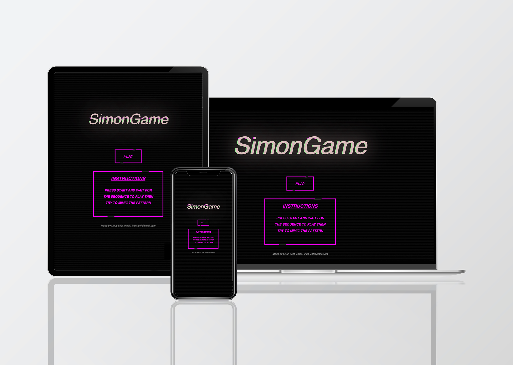
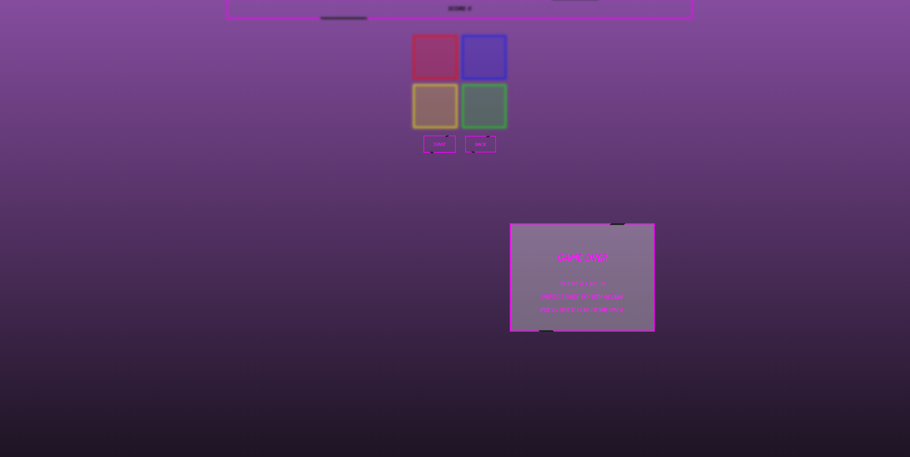
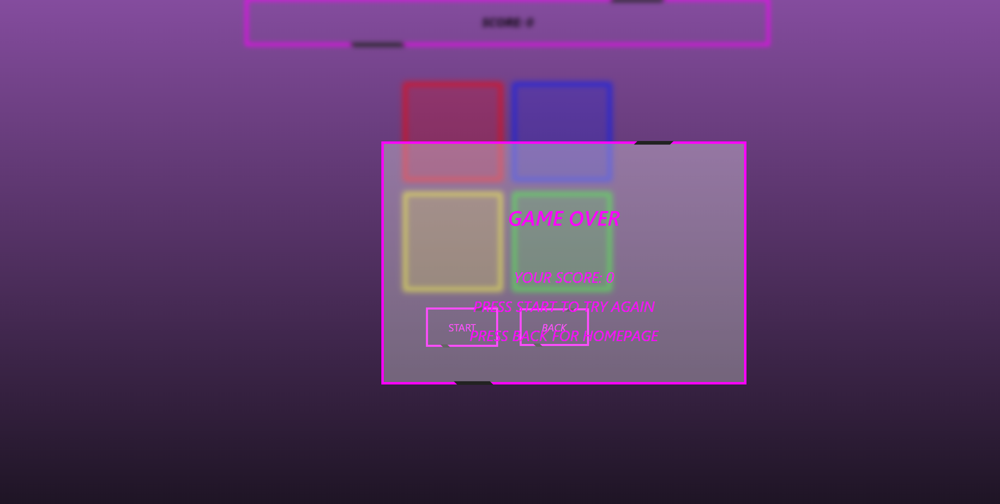
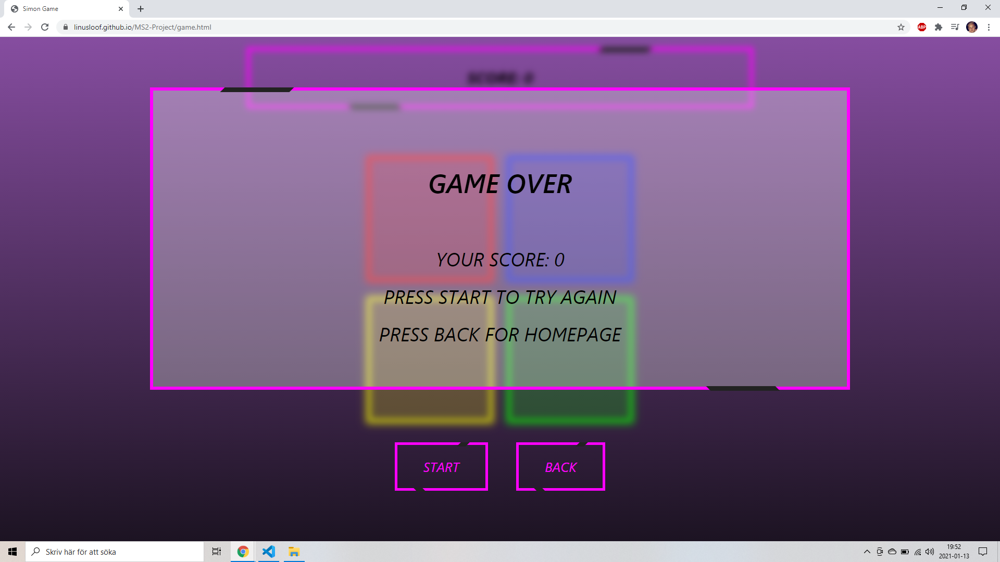

# MS2-PROJECT-SimonGame

---

[View the live project here](https://linusloof.github.io/MS2-Project/)

---

# Table of contents

* [Inspiration](#Inspiration)
* [UX](#UX)
* [Features](#features)
* [Screenshots](#screenshots)
* [Design](#design)
* [Testing](#testing)
* [Technologies](#technologies)
* [Code](#code/sources)
* [Deployment](#deployment)
* [Contact](#Contact)

---

## Inspiration

As inspiration I have used the classic game "simon says". I wanted to build a game that is entertaining and very stylish at the same time.
I initialy started with another plan which consisted of a webpage of hamburger information since I am a big fan of hamburgers. I started making it but soon realised that I 
wasn't completelty sold on the idea and it didn't turn out like I imagined. Funny story, but that night I had a dream that I started a new project, that was a game instead and it was a simon says game. After that I started a new project that was sprung from the simon says dream. The tone of the game is a cyper/futuristic theme. It made the game a little different from an ordinary simons says game.

---

# UX

#  User stories

##  First Time Visitor Goals

* As a first time visitor, I want to understand the rules of the game even if I haven't played a similar game before.
* As a first time visitor, I want to be able to easily navigate throughout the site to find content.

## Returning Visitor Goals

* As a returning visitor, I want it to be entertaining enough to make me wanna go back to play more.
* As a returning visitor, I want to find the best way to get in contact with the creator with any questions I may have.

##  Frequent User Goals

* As a Frequent User, I want to try to beat my old highscore as well as other players highest score.
* As a Frequent User, I want to get more of a challenge the more I play.

# Features

## Existing Features

* Responsive on all device sizes
* Interactive elements
* Score counter

## Feature ideas to Implement

* Sound effects
* More difficult levels. For example the sequence goes faster.

---

# Design

* ## Colour Scheme
    * The main colors for this game is Magenta and Black.

* ## Typography
    * The Oswald font is the main font used throughout the whole website with Sans Serif as the fallback font in case for any reason the font isn't being imported into the site correctly.

* ## Wireframes 
    * Home Page Wireframe - 
    * Contact Us Page Wireframe - 

---

# Testing

### My methods for testing my webpage consisted of:

* The inspector tool to test if the page was responsive.
* Testing on Google Chrome, Internet Explorer and Safari browsers.
* Testing on variety of devices such as Desktop, Laptop, Android & iOS.
* Having friends and family try to play the game and look for bugs that I didn't catch myself.
*  The W3C Markup Validator and W3C CSS Validator Services were used to validate every page of the project to ensure there were no syntax errors in the project.

    * [W3C Markup Validator](https://validator.w3.org/)
    * [W3C CSS Validator](https://jigsaw.w3.org/css-validator)

* In the future I plan to implement automated tests.

### Testing User Stories from UX Section

##  First Time Visitor Goals

* As a first time visitor, I want to understand the rules of the game even if they haven't played a similar game before.
    * The first page has instructions that explains the basics of how to play the game.
* As a first time visitor, I want to be able to easily navigate throughout the site to find content.
    * The first page has a play button as well as instructions on how to start playing.
    * The game page has both a start button and a back button to navigate either to start playing or go back to the first page.

## Returning Visitor Goals

* As a returning visitor, I want it to be entertaining enough to make me wanna go back to play more.
    * Simons says has been a very popular game for a long time. Since this is more or less this type of a game, I find it likely that many users will enjoy it.
    * I've had friends and family try out my game and everyone enjoyed playing it.
* As a returning visitorr, I want to find the best way to get in contact with the creator with any questions I may have.
    * The first page has my name on it along with my email which you can use to get in contact with me.

##  Frequent User Goals

* As a Frequent User, I want to try to beat my old highscore as well as other players highest score.
    * Although I don't have a backend connection for storing highscores yet, users can view their current score on the top of the game page.
* As a Frequent User, I want to get more of a challenge the more I play.
    * The logic of this game is that you mimic a pattern that gets more and more complex. Hence, the better you become the more complex patterns.

## Here is some examples of bugs that I encounterd during testing:

### Screenshots

* In the first two images two former bugs is displayed. These were caught by a couple of friends who was testing the game on their own devices. The problem here was missing media queries for those particular sizes.

* In this image the bugs had been solved.

---

# Technologies

### Languages Used
* HTML5
* CSS3
* Javascript

### Frameworks, Libraries & Programs Used

1. Bootstrap 4.1.3:
    * Bootstrap was used to assist with the responsiveness and styling of the website.
2. Photoshop:
    * Photoshop was used to create the picture on the devices.
3. Google Fonts:
    * Google fonts were used to import the 'Titillium Web' font into the style.css file which is used on all pages throughout the project.
4. GitHub:
    * GitHub is used to store the projects code after being pushed from Git.
5. Git:
    * Git was used for version control by utilizing the Gitpod terminal to commit to Git and Push to GitHub.

---

# Code/Sources

## Content

I used this site to convert SCSS to CSS, i used that on the title for the home screen. The code was original written in SCSS.

https://jsonformatter.org/scss-to-css

I looked at youtube to learn to code this game.

https://www.youtube.com/watch?v=W0MxUHlZo6U

I used hexcolortool to find the right color for my site.

https://www.hexcolortool.com/

This is were i got the inspiration for the title of my game.

https://codepen.io/cybercountess/pen/WNbBxXq

This is were i got the inspiration for my buttons and to highlight my divs.

https://codepen.io/yourpalnurav/pen/LqNmzL

---

## Deployment

### GitHub Pages

The project was deployed to GitHub Pages using the following steps...

1. Log in to GitHub and locate the GitHub Repository
2. At the top of the Repository (not top of page), locate the "Settings" Button on the menu.
* Alternatively Click Here for a GIF demonstrating the process starting from Step 2.
3. Scroll down the Settings page until you locate the "GitHub Pages" Section.
4. Under "Source", click the dropdown called "None" and select "Master Branch".
5. The page will automatically refresh.
6. Scroll back down through the page to locate the now published site link in the "GitHub Pages" section.

### Forking the GitHub Repository

By forking the GitHub Repository we make a copy of the original repository on our GitHub account to view and/or make changes without affecting the original repository by using the following steps...

1. Log in to GitHub and locate the GitHub Repository
2. At the top of the Repository (not top of page) just above the "Settings" Button on the menu, locate the "Fork" Button.
3. You should now have a copy of the original repository in your GitHub account.

### Making a Local Clone

1. Log in to GitHub and locate the GitHub Repository
2. Under the repository name, click "Clone or download".
3. To clone the repository using HTTPS, under "Clone with HTTPS", copy the link.
4. Open Git Bash
5. Change the current working directory to the location where you want the cloned directory to be made.
6. Type git clone, and then paste the URL you copied in Step 3.

$ git clone https://github.com/YOUR-USERNAME/YOUR-REPOSITORY

### 7. Press Enter. Your local clone will be created.
$ git clone https://github.com/YOUR-USERNAME/YOUR-REPOSITORY

> Cloning into `CI-Clone`...

> remote: Counting objects: 10, done.

> remote: Compressing objects: 100% (8/8), done.

> remove: Total 10 (delta 1), reused 10 (delta 1)

> Unpacking objects: 100% (10/10), done.

Click Here to retrieve pictures for some of the buttons and more detailed explanations of the above process.

---

## Contact

E-mail: Linus.loof96@gmail.com

